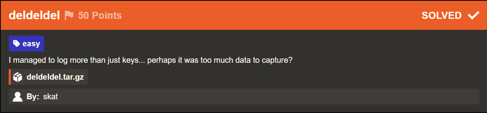
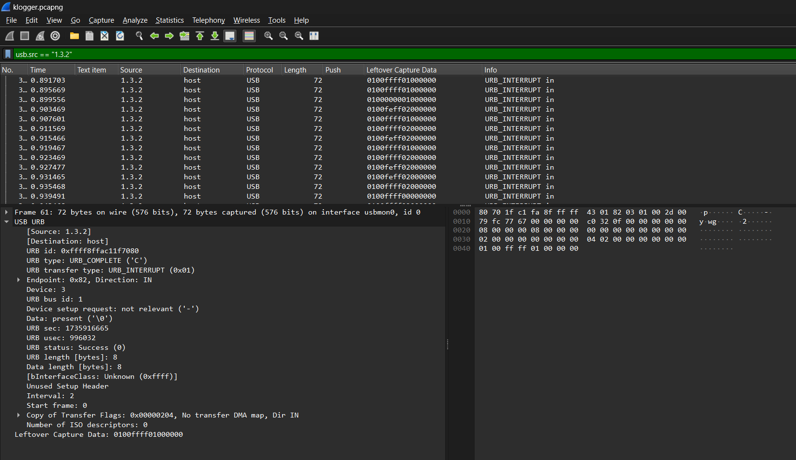

# Deldeldel

## Challenge Description



Source File: [deldeldel.tar.gz](./assets/deldeldel.tar.gz)

## Solution

We are give a packet capture file for this challenge.On viewing it in Wireshark a stream of USB packets can be discoverd.



The file name indicating a `keylogger` and the packets from ip 1.3.2 with Leftover Capture data that would be 8 byte strings made me believe for certain that its USB keyboard communicating with our host.

### Parsing USB CAP Data
I used the following online Keyboard parser tool to parse the HID data and hence retrieve the flag.

```bash
(https://github.com/5h4rrk/CTF-Usb_Keyboard_Parser/blob/main/Usb_Keyboard_Parser.py)
```

```bash
w0lf@hp:~$ python3 Usb_Keyboard_Parser.py klogger.pcapng
[-] Found Modifier in 310 packets [-]

[+] Using filter "usb.capdata" Retrived HID Data is :

Hheey   AAalicce! Ii  tthink  Ii''m  ssupppooseed  too  giivee yoou   tiss fllaag:

iriisctfF{[tthis_akeyloggeer_iisS_too_hard_to_use}
```

Flag: 
```yaml
irisctf{this_keylogger_is_too_hard_to_use}
```