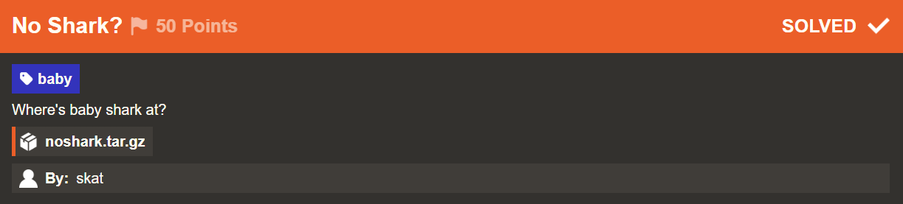
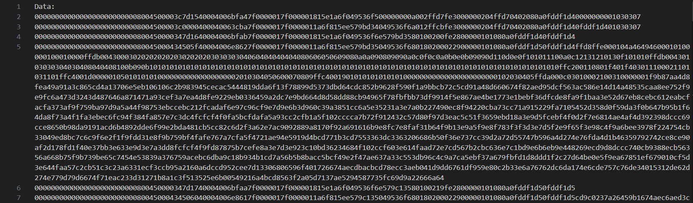
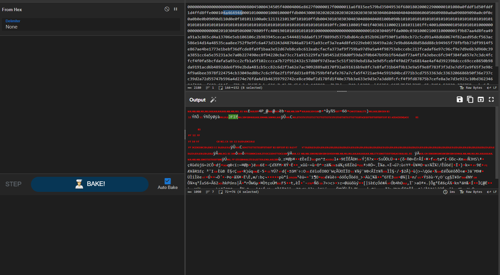

# No Shark?

## Challenge Description



Source File: [noshark.tar.gz](./assets/noshark.tar.gz)

## Solution

We received a text file for this challenge which contained some hex encoded data that on initial inspection on cyberchef, happened to be a tcp packet data file.
 


On analysing the initial data streams, the first lengthy stream happened to catch my eye with `JFIF` magic bytes being evidently present which made me believe these are the data packets of a TCP file transfer stream wherein a .jpeg file was sent and hopefully that should contain our flag as well.



### Constructing the image
We can write a simple python script to do the task i.e. remove the first 64 bytes of all data that correspond to tcp headers and hence happen to be same alternatively, and just take and concat the payload bytes to a new file.

```python
input_file_path = "noshark.txt"
output_file_path = "output.jpg"

with open(input_file_path, "r") as input_file, open(output_file_path, "wb") as output_file:
    hex_data = ''
    for line in input_file:
        processed_line = line.strip()
        hex_data += processed_line[132:]
    trimmed_data = hex_data[32:]
    decoded_data = bytes.fromhex(trimmed_data)
    output_file.write(decoded_data)

print(f"Data has been successfully processed and saved to {output_file_path}.")
```


Flag: 
```yaml
irisctf{welcome_to_net_its_still_ez_to_read_caps_without_wireshark}
```