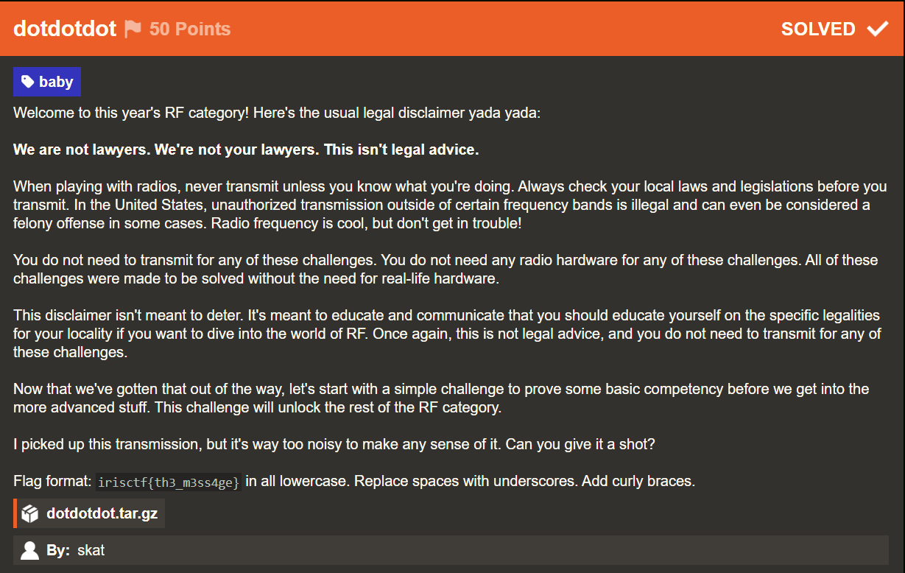
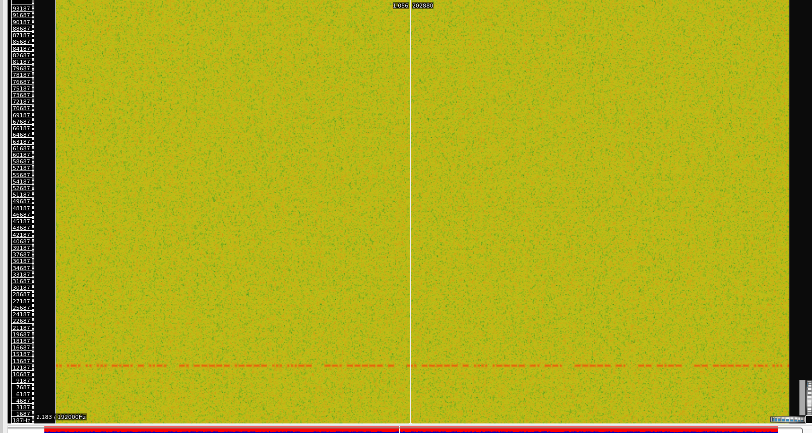

# dotdotdot

## Challenge Description



Source File: [dotdotdot.tar.gz](./assets/dotdotdot.tar.gz)

## Solution

We are given a .iq file, which are standard RF signal files, so the first step was to convert it to corresponding .wav file which can be easily done using the following commnd.

```bash
sox -e float -t raw -r 192000 -b 32 -c 2 dotdotdot.iq -t wav -e float -b 32 -c 2 -r 192000 output.wav
```
Once we have the data as the wav file, the first thing to inspect was obviously the spectrogram and once we do so, we immediately observe a morse codee present at one of the frequncies.



### Constructing the Flag

Now it would have been ideal to apply a low pass filter to make the morse more predominent and then use audio morse decoder but I just went on with manual decoding of the morse using a morse conversion sheet.

Flag: 
```yaml
irisctf{n01s3_g0t_n0th1ng_0n_my_m0rse}
```
